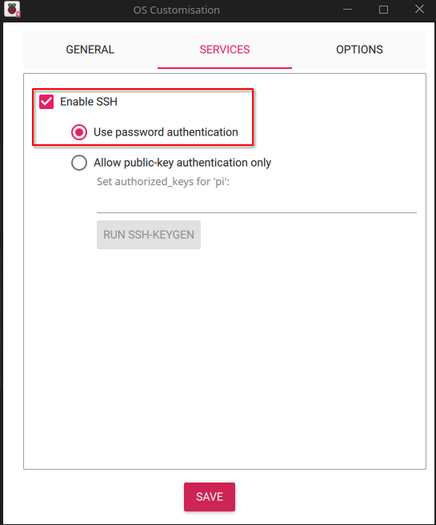

# OpenTpCast Updated
An updated script to support OpenTpCast for 6.12.25+rpt-rpi-v7 #1 SMP Raspbian

## Perquisites
1. USB-to-LAN adapter [like this one](https://www.amazon.com/UGREEN-Network-Ethernet-Supports-Nintendo/dp/B00MYTSN18/ref=sr_1_11?sr=8-11)
2. [RPI-IMAGER](https://www.raspberrypi.com/software/)
3. Micro SD-CARD from 4GB up to 128GB
4. Basic knowlage in linux and networking

## Step one - Raspbian install to SD card
1. Insert the new Micro SD-CARD to your computer
2. Open RPI-IMAGER
3. Set "RaspBerry Pi Device as "No Filtering", Operating system as "OS Lite 32-bit", select the SD card and click next<br>

4. On the propmt click "Edit settings"<br>

5. Edit the values as shown in the picture, <br>
   i. Set hostname to: tpcast <br>
   ii. Set username to: pi and set the password as: 1qaz2wsx3edc4rfv <br>
   iii. Set SSID and password to your TPCAST adapter Network name and password <br>
   iv. Set LAN country to your local country code <br>
   v. Set locale settings to your local timezone, set layout to: us <br>

6. Go to "Services" tab and enable SSH <br>

7. Go to "Options" tab and tic/untic the options as shown in the image <br>

8. Continue to flash the Micro SD-CARD <br>

## Step two - Installing Software
1. Backup VirtualHere license from old SD-CARD by navigating to http://<tpcastip>/#settings-virtualhere and hovering above the censored license key<br>

2. Dissasemble the unit as shown [here](https://github.com/OpenTPCast/Docs/blob/master/guides/SDCARD.md) and replace the old Micro SD-CARD with the new flashed one. Keep the old one in case you decide to revert it back <br>
3. Disconnect both USB and power jack from the unit and connect the LAN-to-USB adapter to the USB port instead, connect it to your home router/switch with internet access <br>
4. Find the IP address of your tpcast using [AngryIPScanner](https://angryip.org/) <br>
5. Connect to your tpcast using [Putty](https://www.putty.org/) or any other SSH interface of your choice <br>
6. After SSH'ing to your tpcast, run the following command: ```wget -O - https://raw.githubusercontent.com/david-hez-net/OpenTpCastUpdatedScript/refs/heads/main/transform_image.sh | bash```
7. Let the script install everything and reboot your device. After rebooting, try to SSH again to verify that the unit is ok. Then disconnect the LAN-to-USB adapter and reconnect the headset.
8. Verify that VirtualHere client is able to see the headset and that SteamVR works as expected

Credit: [OpenTPCast](https://github.com/OpenTPCast)
